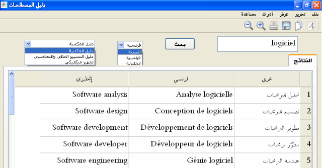
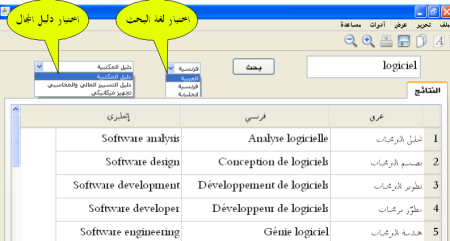

# HCLA Lexique
## معاجم المجلس الأعلى للغة العربية
Dictionaries of the High Council of the Arabic Language

[برنامج للبحث في أدلة المصطلحات](https://sourceforge.net/projects/hclalexique/files/ "تحميل") المعدّة في [المجلس الأعلى للغة العربية](http://www.hcla.dz)، وفيه حاليا:

- دليل المكتبية
- دليل التسيير المالي والمحاسبي
- دليل التجهيز الميكانيكي.

ونطمح مستقبلا إلى إدراج أدلة أخرى، ليستفيد الناس مما يضعه المجلس من مصطلحات، كما يمكن إرفاقه بالدليل المطبوع في قرص مضغوط.

### مزايا البرنامج

يسمح بالبحث في العديد من الأدلة التي وضعها خبراء بإشراف المجلس الأعلى للغة العربية بالجزائر

*   البحث حسب اللغة : عربي، فرنسي، إنجليزي
*   سهولة الاستخدام.
*   تصدير نتائج البحث وحفظها
*   إمكانية نسخ النتائج في برامج أخرى.
*   إمكانيات البحث بجزء من الكلمة.
*   إمكانية إضافة أدلة أخرى للبرنامج.
*   إمكانية تحميل البرنامج لاستخدامه على جهاز الحاسوب في أي وقت.
*   إمكانية استغلال البرنامج مباشرة من موقع المجلس ( دون الحاجة لتنصيبه) سيتم وضعه قريبا.

### صور

 

#### طريقة الاستعمال

### روابط
* [رابط التحميل](https://sourceforge.net/projects/hclalexique/files/) 
* [موقع البرنامج](http://hclalexique.sf.net) 
* موقع المجلس: [http://www.hcla.dz](http://www.hcla.dz/)
